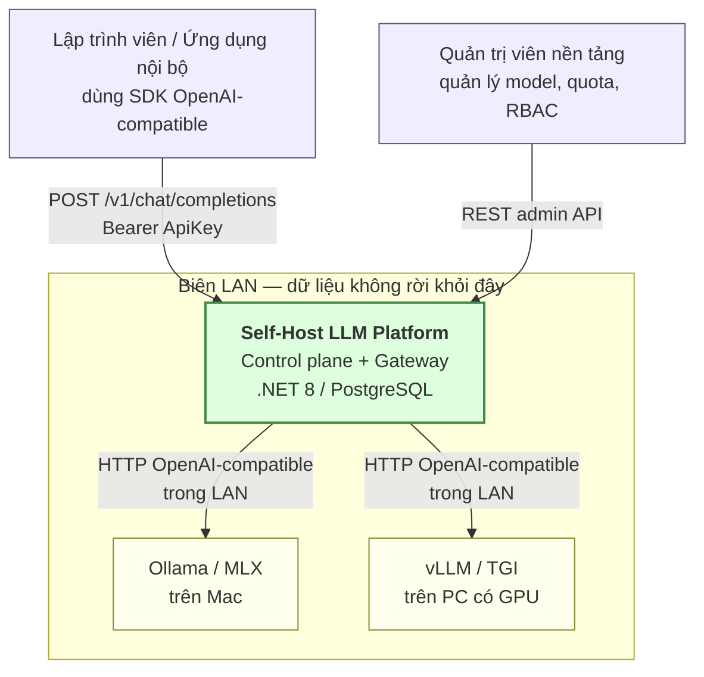
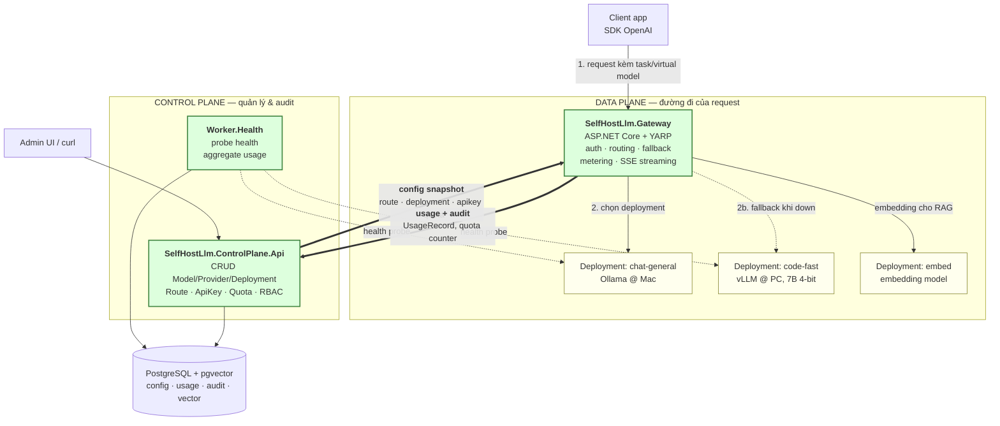
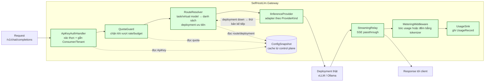
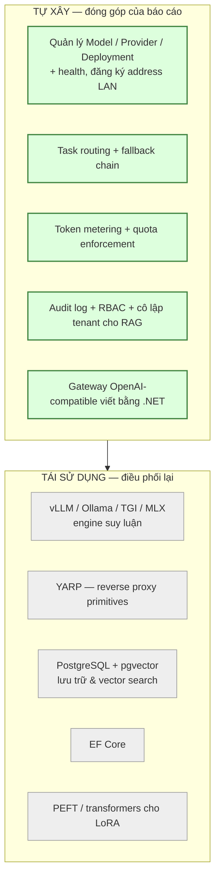

# Kiến trúc tổng thể

Tài liệu này mô tả kiến trúc của Self-Host LLM Management Platform ở ba mức: bối cảnh
(context), thành phần triển khai (container) và cấu tạo bên trong của Gateway (component).

Nguyên tắc xuyên suốt: **tách control plane khỏi data plane**. Control plane quản lý cấu hình,
quota và audit; data plane là đường đi thật của request suy luận. Gateway đọc cấu hình từ
control plane và ghi ngược usage/audit về — hai chiều này phải nhìn thấy được trên sơ đồ.

---

## 1. Context diagram

Ai dùng hệ thống, và hệ thống nói chuyện với cái gì bên ngoài.

Không có mũi tên nào đi ra Internet trong luồng chính — đây là luận điểm bảo mật của báo cáo.

---

## 2. Container diagram — tách control plane / data plane

Hai mũi tên đậm giữa `ControlPlane.Api` và `Gateway` chính là hợp đồng giữa hai mặt phẳng:

| Chiều | Nội dung | Tần suất |
|---|---|---|
| Control → Data | Danh sách deployment, route/virtual model, ApiKey hash, quota | Cache + refresh định kỳ / khi có thay đổi |
| Data → Control | `UsageRecord`, bộ đếm quota, sự kiện audit ở mức request | Sau mỗi request, có thể batch |

Gateway **không** truy vấn thẳng bảng config ngoài lớp snapshot của nó, và control plane
**không** nằm trên đường đi của request suy luận — nếu control plane chết, gateway vẫn phục vụ
được bằng snapshot gần nhất.

---

## 3. Component diagram — bên trong Gateway

Đây là phần tự xây trọng tâm của báo cáo.

Điểm cần chú ý khi implement:

- **Metering với streaming**: với SSE, `usage` chỉ xuất hiện ở chunk cuối (và không phải engine
  nào cũng trả). Fallback là đếm bằng tokenizer của model — chấp nhận sai số nhỏ, phải ghi rõ
  trong báo cáo là con số ước lượng.
- **Fallback**: `RouteResolver` trả về một *danh sách có thứ tự*, không phải một deployment.
  Adapter thất bại → thử phần tử kế tiếp. Chỉ fallback khi lỗi kết nối / 5xx / timeout, không
  fallback khi client gửi request sai (4xx).
- **Quota**: kiểm tra trước khi gọi (dựa trên bộ đếm hiện tại) và cập nhật sau khi có usage
  thật. Đây là best-effort, không phải transaction chặt — nêu rõ giới hạn này.

---

## 4. Tự xây vs tái sử dụng

Ranh giới đóng góp của báo cáo:

So với LiteLLM / OpenWebUI: các công cụ đó đã làm sẵn proxy và UI. Điểm khác biệt được bảo vệ
trong báo cáo là **mô hình quản trị deployment theo address + task routing + lớp audit/tenant
isolation hướng doanh nghiệp**, chứ không phải bản thân việc proxy request.
