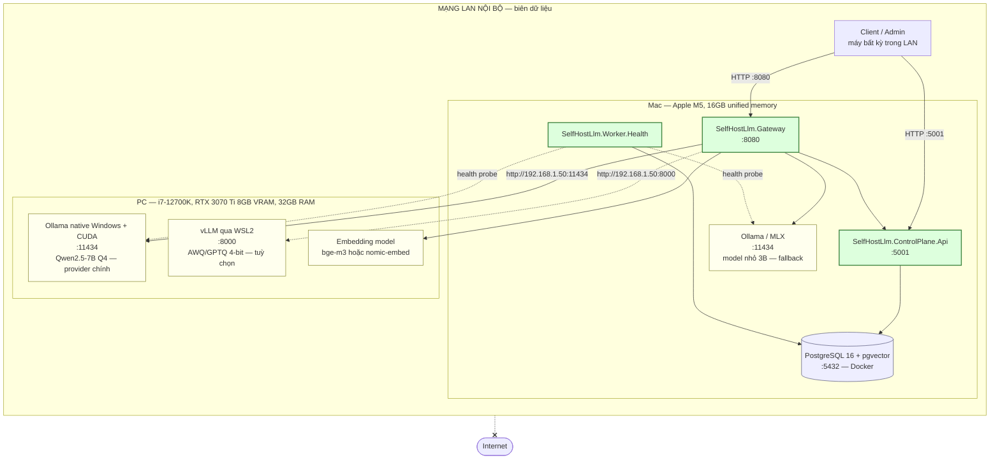

# Hạ tầng triển khai demo

Sơ đồ triển khai thật của đồ án: hai máy khác kiến trúc, hai loại provider khác nhau, nối với
nhau qua LAN. Mục đích là chứng minh bằng hiện vật rằng mô hình
`Provider × Address × Deployment` hoạt động được trên hạ tầng không đồng nhất — và rằng **dữ
liệu suy luận không rời khỏi mạng nội bộ**.

---

## 1. Sơ đồ triển khai



Đường `lan -.-x internet` không phải trang trí: trong luồng suy luận chính **không có** lời gọi
ra API model thương mại. Đây là luận điểm bảo mật được bảo vệ trong báo cáo.

---

## 2. Phân bổ thành phần

| Máy | Thành phần | Port | Vai trò |
|---|---|---|---|
| Mac M5 16GB | `ControlPlane.Api` | 5001 | Admin API, RBAC, audit |
| Mac M5 16GB | `Gateway` | 8080 | Data plane, endpoint OpenAI-compatible |
| Mac M5 16GB | `Worker.Health` | — | Health probe, aggregate usage |
| Mac M5 16GB | PostgreSQL + pgvector (Docker) | 5432 | Config, usage, audit, vector |
| Mac M5 16GB | Ollama / MLX, model 3B | 11434 | Provider phụ / fallback |
| PC RTX 3070 Ti | Ollama native + CUDA, 7B Q4 | 11434 | Provider GPU chính |
| PC RTX 3070 Ti | vLLM qua WSL2 (tuỳ chọn) | 8000 | Provider "chất enterprise" hơn |
| PC RTX 3070 Ti | Embedding model | 11434 | Sinh vector cho RAG |

PC đăng ký vào control plane bằng **IP nội bộ** (ví dụ `http://192.168.1.50:11434`). Nên đặt IP
tĩnh hoặc DHCP reservation cho PC — deployment lưu address dạng URL, đổi IP là phải sửa lại.

---

## 3. Ollama hay vLLM trên PC

Cả hai đều nói chuẩn OpenAI nên adapter chỉ viết một lần. Khác nhau ở độ ma sát khi vận hành.

| | Ollama (native Windows + CUDA) | vLLM (qua WSL2) |
|---|---|---|
| Cài đặt | Installer, chạy ngay | WSL2 + CUDA toolkit + pip, nhiều bước |
| Model | GGUF quantize sẵn, `ollama pull` | Cần bản AWQ hoặc GPTQ 4-bit |
| Vừa 8GB VRAM | Tự offload phần thừa xuống RAM | Phải tự chỉnh `--max-model-len` và `--gpu-memory-utilization` |
| Throughput | Khá, đủ cho demo | Cao hơn rõ rệt khi nhiều request đồng thời (PagedAttention) |
| Rủi ro demo | Thấp | Trung bình — dễ OOM nếu chỉnh sai |
| Dùng khi | Mặc định cho demo | Muốn số liệu benchmark đẹp hơn trong báo cáo |

**Khuyến nghị:** Ollama là provider chính để demo chạy chắc; dựng thêm vLLM như deployment thứ
hai của cùng một model nếu còn thời gian — vừa có số liệu so sánh, vừa là ví dụ sống cho cơ chế
fallback giữa hai provider khác loại.

Gợi ý tham số vLLM cho 8GB VRAM (phải đo lại trên máy thật):

```bash
python -m vllm.entrypoints.openai.api_server \
  --model Qwen/Qwen2.5-7B-Instruct-AWQ \
  --quantization awq \
  --max-model-len 4096 \
  --gpu-memory-utilization 0.90 \
  --port 8000 --host 0.0.0.0
```

`--max-model-len` là nút vặn quan trọng nhất: KV cache tăng tuyến tính theo context length, và
đây thường là thứ làm tràn 8GB chứ không phải trọng số model.

---

## 4. Ràng buộc phần cứng cần nhớ

- **8GB VRAM** ⇒ serving tốc độ cao giới hạn ở model **7B–8B quantize 4-bit** (Qwen2.5-7B,
  Llama-3.1-8B). Không nhét 13B+ vào VRAM.
- **32GB RAM trên PC** ⇒ Ollama có thể offload model lớn hơn xuống RAM nếu muốn demo model to
  — nhưng chậm rõ rệt. Giữ 7B–8B trong VRAM để tốc độ tương tác chấp nhận được.
- **16GB unified memory trên Mac** ⇒ chạy đồng thời control plane, gateway, Postgres và một
  model nhỏ thì vừa. Đừng đặt model 7B trên Mac cùng lúc với cả stack.
- Embedding model nhỏ, đặt ở PC hay Mac đều được — ưu tiên đặt cùng chỗ với dữ liệu RAG để
  giảm một chặng mạng.

---

## 5. Thứ tự khởi động

```bash
# 1. Trên Mac — hạ tầng lưu trữ
docker compose -f deploy/docker-compose.yml up -d     # Postgres + pgvector

# 2. Trên Mac — model fallback
ollama serve                                          # hoặc chạy nền sẵn

# 3. Trên PC — provider GPU chính, phải lắng nghe trên LAN
#    Windows: đặt OLLAMA_HOST=0.0.0.0:11434 rồi khởi động lại Ollama
#    và mở port 11434 trong Windows Firewall cho mạng private

# 4. Trên Mac — control plane rồi gateway
dotnet run --project src/SelfHostLlm.ControlPlane.Api
dotnet run --project src/SelfHostLlm.Gateway
```

Hai lỗi hay gặp nhất khi dựng lần đầu:

1. **Ollama trên Windows chỉ nghe `127.0.0.1`** — Mac không gọi được. Phải đặt biến môi trường
   `OLLAMA_HOST=0.0.0.0:11434`.
2. **Windows Firewall chặn cổng 11434 / 8000** từ mạng private. Phải mở thủ công.

Kiểm tra nhanh từ Mac trước khi đăng ký deployment:

```bash
curl http://192.168.1.50:11434/v1/models
```
