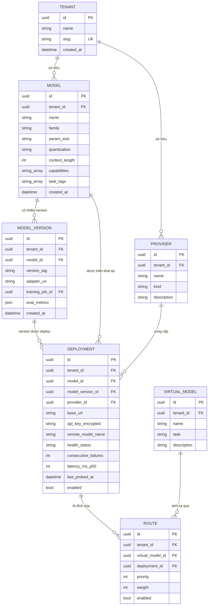
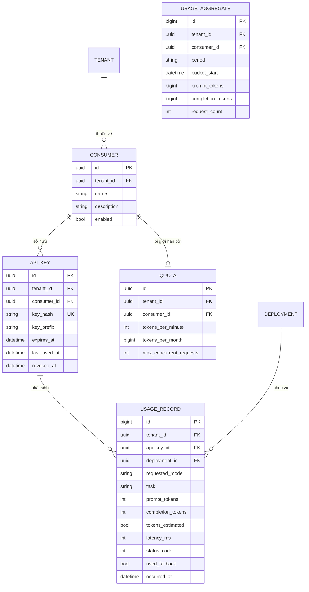
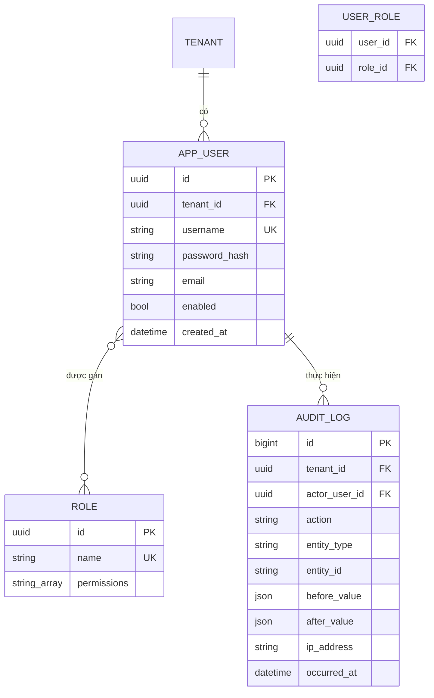
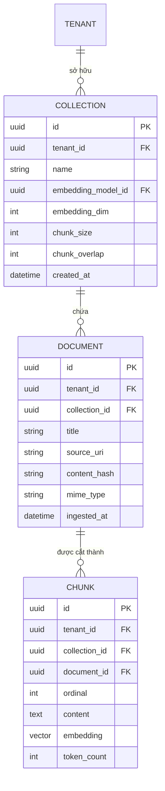
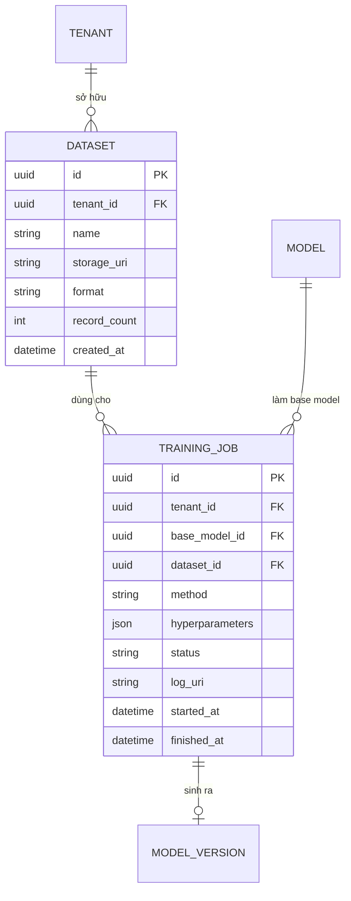

# Mô hình dữ liệu (ERD)

Domain model của nền tảng, chia thành năm nhóm: Core, Access & metering, Security, RAG và
Training. Tên thực thể ở đây phải khớp với bảng domain model trong `CLAUDE.md`.

Quan hệ trục của toàn hệ thống: **`Model` (1—n) `Deployment` (n—1) `Provider`**. Một model chạy
được ở nhiều nơi; gateway coi các deployment của cùng một model là endpoint thay thế nhau.

---

## 1. Core — model, provider, deployment, routing

Ghi chú thiết kế:

- `DEPLOYMENT.base_url` chính là **Address** trong tài liệu kiến trúc — nơi cặp Model × Provider
  thực sự sống. Khoá duy nhất nên đặt trên `(provider_id, base_url, remote_model_name)`.
- `remote_model_name` cần thiết vì tên model phía engine thường khác tên logic của ta
  (`qwen2.5:7b-instruct-q4_K_M` so với `Qwen2.5-7B`).
- `ROUTE.priority` quyết định thứ tự fallback: `RouteResolver` sắp xếp theo `priority` tăng dần,
  bỏ các deployment `Unhealthy` hoặc `enabled = false`.
- `model_version_id` cho phép null — deployment của model gốc chưa fine-tune không có version.
- `api_key_encrypted`: kể cả trong LAN vẫn không lưu plaintext, đây là điểm nhỏ nhưng hợp với
  trục bảo mật của báo cáo. Mã hoá bằng ASP.NET Core Data Protection; key ring lưu ở thư mục
  file riêng (không nằm trong DB) — có bản dump DB vẫn không giải mã được.
- `MODEL.name` và `VIRTUAL_MODEL.name` **duy nhất trong phạm vi tenant** — unique
  `(tenant_id, name)`, không phải toàn cục. Gateway resolve virtual model theo
  (tenant của ApiKey, name).
- `MODEL_VERSION`, `DEPLOYMENT`, `ROUTE` mang `tenant_id` dù suy ra được qua FK — theo quy ước
  mọi bảng có dữ liệu người dùng đều mang `tenant_id` (xem mục 6, *Composite FK theo tenant*).

---

## 2. Access & metering — consumer, key, usage, quota

Ghi chú thiết kế:

- **Chỉ lưu `key_hash`**, không bao giờ lưu API key gốc. `key_prefix` (ví dụ `sk-a1b2`) để hiển
  thị trong UI cho người dùng nhận ra key nào là key nào.
- `USAGE_RECORD.tokens_estimated` đánh dấu những bản ghi mà engine không trả `usage` và ta phải
  đếm bằng tokenizer. Báo cáo phải phân biệt được số đo thật và số ước lượng.
- `USAGE_RECORD.deployment_id` **cho phép null**: khi mọi deployment trong chuỗi fallback đều
  lỗi, request vẫn được ghi lại (ví dụ status 502) nhưng không có deployment nào phục vụ.
- Ba giới hạn của `QUOTA` đều **cho phép null** — null nghĩa là không giới hạn chiều đó.
  `QUOTA.consumer_id` unique (mỗi consumer tối đa một quota).
- `used_fallback` là cột rẻ tiền nhưng cho ra một biểu đồ đẹp trong báo cáo: tần suất fallback
  theo thời gian.
- `USAGE_AGGREGATE` do `Worker.Health` tổng hợp định kỳ. Enforce quota đọc bảng aggregate cộng
  với bộ đếm in-memory của phút hiện tại, không quét toàn bộ `USAGE_RECORD`.

---

## 3. Security — user, role, audit

Ghi chú thiết kế:

- Role gợi ý: `PlatformAdmin` (toàn quyền), `TenantAdmin` (quản lý trong tenant của mình),
  `Operator` (đăng ký/sửa deployment, không đụng RBAC), `Viewer` (chỉ đọc usage và audit).
- `AUDIT_LOG` là **append-only**: không có endpoint sửa hay xoá, và ở tầng DB có trigger
  `trg_audit_log_append_only` / `trg_audit_log_no_truncate` chặn `UPDATE`, `DELETE`,
  `TRUNCATE`. Ghi `before_value` / `after_value` (jsonb) cho các thao tác cập nhật.
- `AUDIT_LOG.actor_user_id` **cho phép null** (thao tác của hệ thống: seed, job nền) và là FK
  đơn tới `APP_USER` — PlatformAdmin thao tác xuyên tenant nên actor không nhất thiết cùng
  tenant với bản ghi.
- `APP_USER` / `ROLE` / `USER_ROLE` được hiện thực bằng **ASP.NET Core Identity** (bảng đổi tên
  về tên trong sơ đồ). Identity bổ sung các cột riêng (`normalized_user_name`,
  `normalized_email`, `security_stamp`, `concurrency_stamp`, `lockout_*`, ...) và các bảng phụ
  `user_claim`, `user_login`, `user_token`, `role_claim`. `ROLE.permissions` là `text[]`; bốn
  role hệ thống được seed trong migration đầu tiên.
- Ghi audit cho mọi thao tác quản trị (tạo/sửa/xoá deployment, cấp và thu hồi ApiKey, đổi
  quota, đổi role). Request suy luận thông thường đi vào `USAGE_RECORD`, không làm phồng audit.

---

## 4. RAG — collection, document, chunk, embedding

Ghi chú thiết kế — đây là phần nhạy cảm nhất về bảo mật:

- `tenant_id` **lặp lại trên cả `DOCUMENT` và `CHUNK`**, dù có thể suy ra qua `collection_id`.
  Cố ý phi chuẩn hoá để mọi truy vấn vector lọc được tenant trực tiếp trong `WHERE`, không phải
  join rồi mới lọc.
- Index cần có:
  - `CREATE INDEX ON chunk (tenant_id, collection_id);`
  - Index vector HNSW trên `chunk(embedding)` với opclass `vector_cosine_ops`. Truy vấn phải
    dùng toán tử cosine `<=>` (không phải `<->`) thì mới dùng được index này.
  - `embedding` có kiểu cố định `vector(1024)` (bge-m3); `COLLECTION.embedding_dim` bị check
    constraint ép bằng 1024.
  - Cân nhắc **partial index theo tenant** nếu số tenant ít và dữ liệu lớn.
- `embedding_dim` gắn ở `COLLECTION`: đổi embedding model là phải re-ingest cả collection, vì
  vector khác chiều và khác không gian. Ràng buộc này phải chặn ở tầng API.
- `content_hash` để chống ingest trùng cùng một tài liệu.
- Cân nhắc bật **Row Level Security** của PostgreSQL trên các bảng RAG như lớp phòng thủ thứ
  hai — nếu làm được thì đây là một điểm cộng rõ ràng cho phần bảo mật của báo cáo.

---

## 5. Training — dataset, job, model version

Ghi chú thiết kế:

- `TRAINING_JOB.method` chỉ nhận `LoRA` hoặc `QLoRA` — không hỗ trợ full fine-tune.
- `status`: `Queued`, `Running`, `Succeeded`, `Failed`, `Cancelled`.
- Trọng số adapter **không** lưu trong database, chỉ lưu URI (`MODEL_VERSION.adapter_uri`).
- Toàn bộ nhóm này là pluggable/demo — xem sơ đồ 4 trong `docs/sequences.md`.

---

## 6. Quy ước chung cho toàn schema

| Quy ước | Nội dung |
|---|---|
| Khoá chính | `uuid` cho entity nghiệp vụ; `bigint identity` cho bảng ghi log lớn (`USAGE_RECORD`, `AUDIT_LOG`) |
| Tenant | Mọi bảng có dữ liệu người dùng đều mang `tenant_id`, kể cả khi suy ra được qua FK |
| Thời gian | `timestamptz`, luôn lưu UTC |
| Xoá | Soft delete (`enabled` / `revoked_at`) cho ApiKey và Deployment — xoá cứng làm mất tính toàn vẹn của usage lịch sử |
| Đặt tên | Bảng và cột `snake_case` trong Postgres, entity `PascalCase` trong C# — map qua naming convention của EF Core |
| Index thời gian | `USAGE_RECORD (tenant_id, occurred_at)` và `AUDIT_LOG (tenant_id, occurred_at)` cho truy vấn báo cáo |
| Tên bảng | Số ít, trùng tên thực thể trong sơ đồ (`model`, `deployment`, `api_key`, `chunk`...) |
| Composite FK theo tenant | Mọi FK giữa hai bảng có `tenant_id` là FK tổng hợp `(tenant_id, x_id) → parent(tenant_id, id)` (bảng cha có alternate key `(tenant_id, id)`). DB từ chối tham chiếu chéo tenant kể cả khi code tầng trên có bug |
| Enum | Lưu dạng string, kèm check constraint liệt kê giá trị hợp lệ |
| Id tự sinh | `USAGE_RECORD`, `AUDIT_LOG`, `USAGE_AGGREGATE` dùng `bigint GENERATED ALWAYS AS IDENTITY` |
