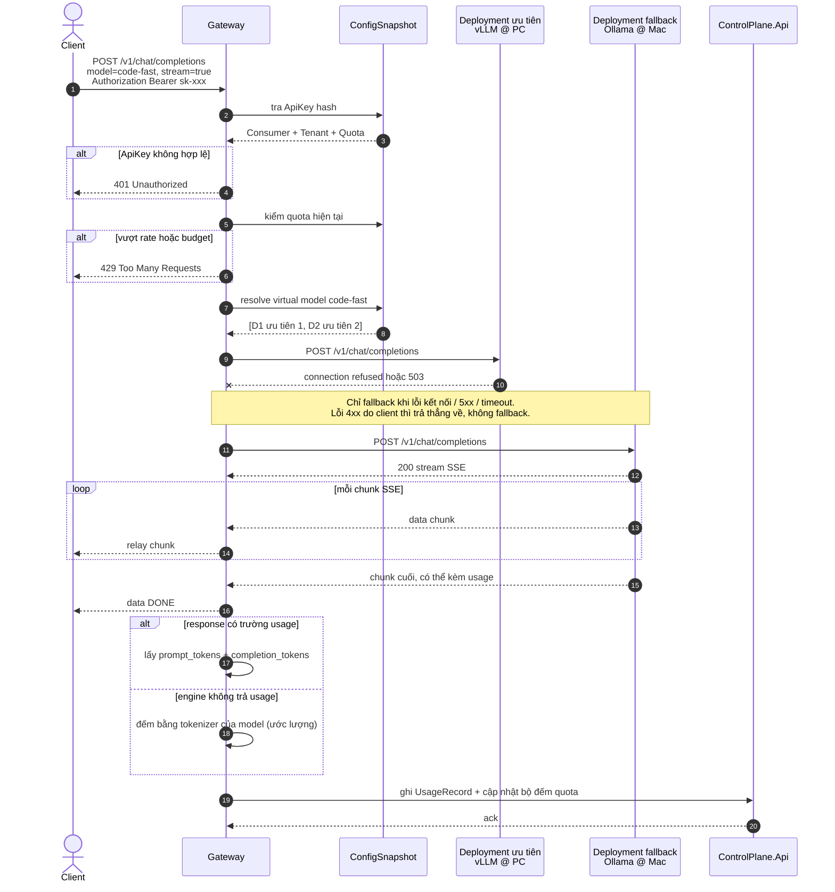
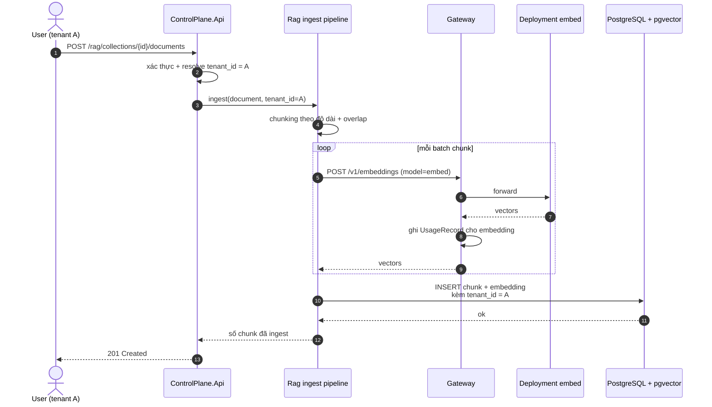
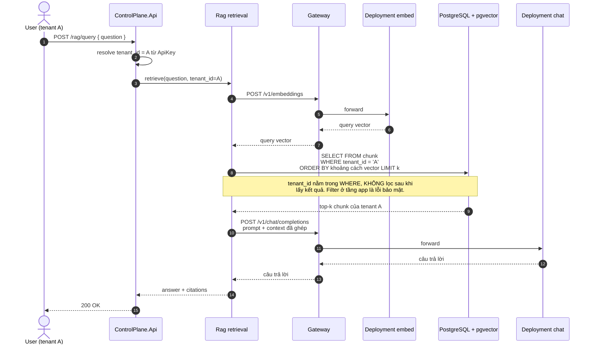
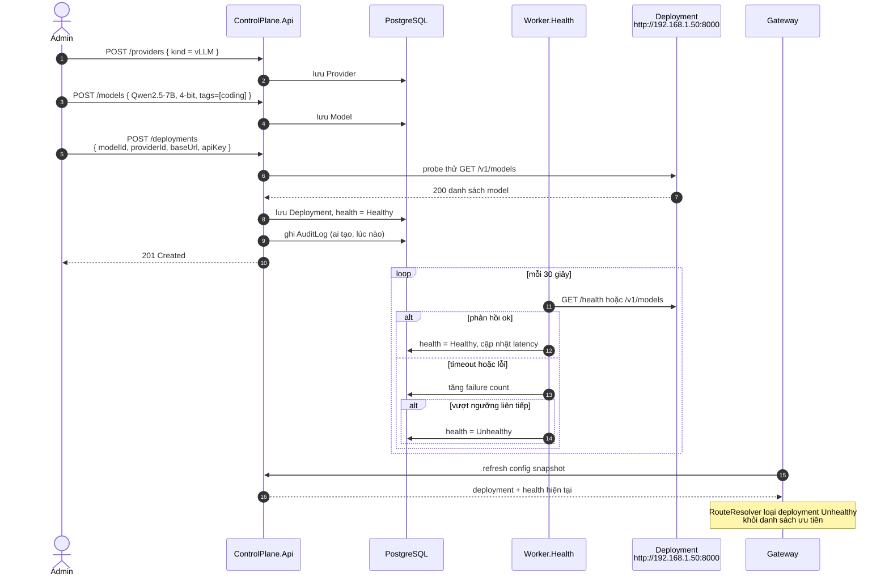
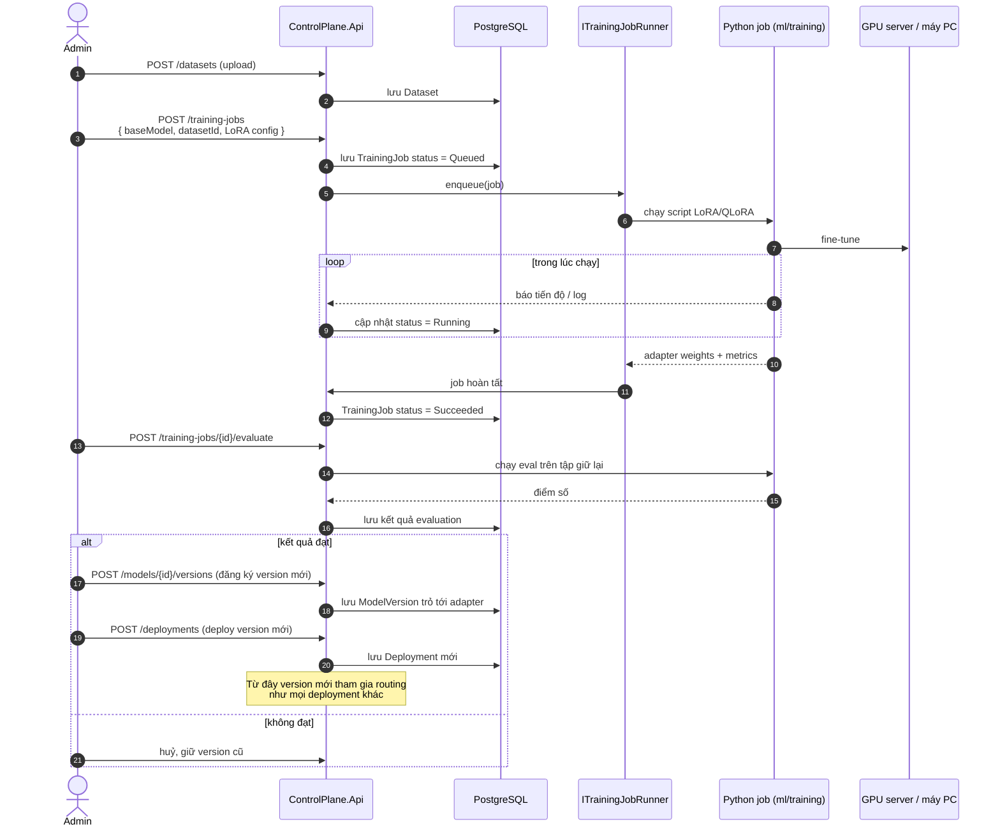

# Sequence diagrams

Bốn luồng chính của hệ thống. Mỗi luồng kèm ghi chú về điểm cần cẩn thận khi implement.

---

## 1. Chat completion — task routing, fallback và metering

Luồng xương sống của data plane. Client gửi `task` hoặc virtual model, gateway tự chọn
deployment thật, nếu deployment ưu tiên chết thì tụt xuống bản thay thế, và mọi request đều
được đếm token.



Lưu ý implement:

- **Metering là hậu kiểm.** Quota được kiểm *trước* khi gọi dựa trên bộ đếm hiện tại, và cập
  nhật *sau* khi có usage thật. Một request vượt ngưỡng ở giữa chừng vẫn chạy xong — đây là
  best-effort, phải nói rõ giới hạn này trong báo cáo thay vì giả vờ nó chặt chẽ.
- **Ghi UsageRecord không được chặn response.** Client đã nhận xong stream trước khi usage được
  ghi. Nếu ghi lỗi thì log lại, không trả lỗi cho client.
- Sai số tokenizer khi engine không trả `usage`: nêu con số trong báo cáo là *ước lượng*.

---

## 2. RAG — ingest và query với cô lập tenant

Điểm bảo mật cốt lõi: **không có code path nào truy vấn vector mà thiếu filter `tenant_id`**.

### 2a. Ingest tài liệu



Embedding cũng đi **qua gateway**, không gọi thẳng engine — để được đếm token và audit như mọi
request khác.

### 2b. Query



Câu truy vấn thật ở bước retrieval:

```sql
-- <=> là cosine distance, khớp index HNSW vector_cosine_ops (QĐ-1)
SELECT c.id, c.content, c.embedding <=> @queryVector AS distance
FROM chunk c
WHERE c.tenant_id = @tenantId
  AND c.collection_id = @collectionId
ORDER BY c.embedding <=> @queryVector
LIMIT @k;
```

Lưu ý implement:

- `tenant_id` phải nằm trong `WHERE` của chính câu truy vấn vector, **không** lọc sau khi đã
  lấy top-k. Lọc sau vừa sai kết quả vừa rò rỉ thông tin về dữ liệu tenant khác.
- Dùng composite index `(tenant_id, ...)` cộng với index vector — xem `docs/erd.md`.
- Nên có một test khẳng định: tenant B query không bao giờ nhìn thấy chunk của tenant A.

---

## 3. Đăng ký deployment và health check

Minh hoạ quan hệ `Model × Provider × Address` và cơ chế giữ cho routing luôn biết cái gì đang
sống.



Lưu ý implement:

- Đánh dấu Unhealthy sau **nhiều lần** lỗi liên tiếp, không phải một lần — tránh nhấp nháy khi
  mạng LAN chập chờn.
- Gateway vẫn có thể gặp deployment chết giữa hai lần probe → fallback ở mục 1 là lớp bảo vệ
  thứ hai, không thể thay thế bằng health check.

---

## 4. Training LoRA/QLoRA — vòng đời model version

Vẽ ở mức **interface**. Đây là phần pluggable, demo bằng model nhỏ. Không hứa hẹn training
thật chạy được trên phần cứng demo.



Lưu ý phạm vi:

- Chỉ **LoRA/QLoRA**, không full fine-tune.
- `ITrainingJobRunner` là một port — GĐ3 chỉ cần một implementation gọi script local là đủ để
  demo. Không xây job scheduler riêng.
- Môi trường thật chạy job trên GPU server / cloud. Trên máy demo chỉ chạy model rất nhỏ để
  chứng minh vòng đời `Dataset → Job → Eval → ModelVersion → Deployment` là khép kín.
